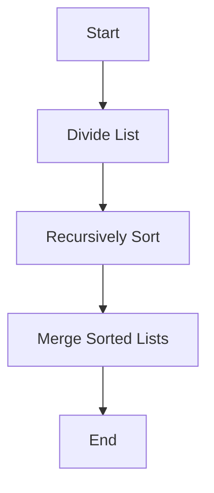

# Präsentation über MergeSort

**Gruppe:** Yaser & Dimitri  
**Thema:** Mergesort Algorithmus  
**Dauer:** ca. 5 Minuten

*[Quelle](https://fullyunderstood.com/pseudocodes/merge-sort/)*
---

## Was ist MergeSort?

MergeSort ist ein **Sortieralgorithmus**, der auf dem Prinzip **Teile und Erobere** (Divide and Conquer) basiert. 
  1. **Teilen (Divide):** Zerlege die Liste in zwei kleinere Listen, bis jede Teil-Liste nur noch ein Element hat.  
  2. **Erobern (Conquer):** Sortiere diese kleinen Listen (einzelne Elemente sind schon sortiert).  
  3. **Vereinen (Merge):** Füge die sortierten Teil-Listen wieder zusammen, dabei entsteht eine komplett sortierte Liste.

*[Quelle](ttps://www.npridik.de/scharfe-bilder-powerpoint/)*
---

## Warum dieses Vorgehen?

- **Vorteile:**  
  - Effiziente Laufzeit: O(n log n)  
  - Stabiler Algorithmus (gleiche Elemente bleiben in Reihenfolge)  
  - Gut für große Datenmengen geeignet
- **Nachteile:**  
  - Braucht zusätzlichen Speicher für das Mergen  
  - Etwas komplexer als einfache Sortiermethoden wie Bubble Sort

*[Quelle](https://www.projektmagazin.de/artikel/mit-systemischem-vorgehen-souveraen-entscheiden_1098373)*
---

## Kurzes Beispiel

Unsortiert: `[8, 3, 5, 4, 2]`

1. Teile in `[8,3]` und `[5,4,2]`
2. Sortiere `[8,3]` → `[3,8]`
3. Sortiere `[5,4,2]`:
   - Teile in `[5]` und `[4,2]`
   - `[4,2]` wird zu `[2,4]`
   - Merge `[5]` & `[2,4]` → `[2,4,5]`
4. Merge `[3,8]` & `[2,4,5]` → `[2,3,4,5,8]` (fertig sortiert)

---

## Flow Chart

### Coding
- Wir haben den Code in **PyCharm** geschrieben und mit **Git** versioniert. Jede Änderung ist ein eigener Commit.

```python
def merge_sort(arr):
    if len(arr) <= 1:
        return arr
    mid = len(arr) // 2
    left = merge_sort(arr[:mid])
    right = merge_sort(arr[mid:])
    return merge(left, right)

def merge(left, right):
    result = []
    i, j = 0, 0
    while i < len(left) and j < len(right):
        if left[i] <= right[j]:
            result.append(left[i])
            i += 1
        else:
            result.append(right[j])
            j += 1
    result.extend(left[i:])
    result.extend(right[j:])
    return result
```
---

## Fazit
MergeSort ist ein mächtiger Algorithmus, besonders für grosse Datenmengen. Während er zusätzlichen Speicher benötigt, überwiegen die Vorteile in den meisten Fällen. Wir haben durch dieses Projekt nicht nur den Algorithmus verstanden, sondern auch gelernt, wie wichtig Struktur und Teamarbeit bei der Entwicklung sind.

## Quellen

- [Introduction to Algorithms (CLRS)](https://mitpress.mit.edu/books/introduction-algorithms)  
- [Python Dokumentation](https://docs.python.org)  
- [pytest Dokumentation](https://docs.pytest.org/)