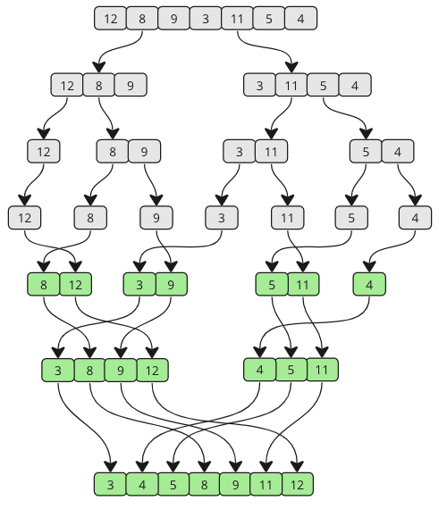

# Präsentation über MergeSort

**Präsentation von:** Yaser  
**Thema:** Mergesort Algorithmus  
**Dauer:** ca. 5 Minuten

*[Quelle](https://fullyunderstood.com/pseudocodes/merge-sort/)*

---
## Was ist MergeSort?
Merge Sort ist ein **Sortieralgorithmus**, der auf dem Prinzip **Teile und Erobere** (Divide and Conquer) basiert. 
  1. **Teilen (Divide):** Zerlege die Liste in zwei kleinere Listen, bis jede Teil-Liste nur noch ein Element hat.  
  2. **Erobern (Conquer):** Sortiere diese kleinen Listen (einzelne Elemente sind schon sortiert).  
  3. **Vereinen (Merge):** Füge die sortierten Teil-Listen wieder zusammen, dabei entsteht eine komplett sortierte Liste.

*[Quelle](ttps://www.npridik.de/scharfe-bilder-powerpoint/)*
---

## Warum dieses Vorgehen?

- **Vorteile:**  
  - Effiziente Laufzeit: O(n log n)  
  - Stabiler Algorithmus (gleiche Elemente bleiben in Reihenfolge)  
  - Gut für große Datenmengen geeignet
- **Nachteile:**  
  - Braucht zusätzlichen Speicher für das Mergen  
  - Etwas komplexer als einfache Sortiermethoden wie Bubble Sort

*[Quelle](https://www.projektmagazin.de/artikel/mit-systemischem-vorgehen-souveraen-entscheiden_1098373)*
---

#### Kurzes Beispiel

[Quelle](https://www.google.com/search?sca_esv=540dfeac42c719c1&rlz=1C5CHFA_enCH1128CH1128&sxsrf=ADLYWILoU2-T9WQ_pvxDLCGCmvXUFOn9SQ:1737052881559&q=Flowchart+Merge+Sort&udm=2&fbs=AEQNm0DlzhzfgcMT762IeLYOzuulDPgyJPevQP2Oosl6sssSrPn5pJs7adjRH8kSeoH51-gL7LD-8cmPkqOR0hRG0Psm2xtLnhE2EakQolUBt88UhVFfwYnjHiytWztiGD40QShZeb4D5FPzsaSiZsM79fFILRLCJzrfFPuFpDuc8r4n9nEc3_HApqyjaz36fz7wwaxMUkIk&sa=X&ved=2ahUKEwiIidif8vqKAxVInf0HHc_DHOYQtKgLegQIFBAB&biw=1512&bih=823&dpr=2#imgrc=AyGbr_mk_BGcOM&imgdii=Lwsi3WdSV1k83M)
---

### Coding Test Unit Test
- ich habe den Code in **PyCharm** geschrieben getestet und mit **Git** versioniert. Jede Änderung ist ein eigener Commit.

```Python
import unittest

from mergesort import mergesort


class MyTestCase(unittest.TestCase):
    def test_sorting(self):
        a = [99, 88, 77, 33, 11]  # Arrange
        result = mergesort(a)  # Act
        self.assertEqual([11,33,77,88,99], result)  # Assert
```
---

## Fazit

<span style="font-size: 14px;">Merge Sort ist ein leistungsstarker Algorithmus, der besonders gut für grosse Datenmengen geeignet ist. Durch dieses Projekt habe ich gelernt, wie der Algorithmus funktioniert und warum das "Teile-und-Erobere"-Prinzip so effektiv ist. Außerdem hat es mir geholfen, meine Fähigkeit zur strukturierten und organisierten Arbeit zu verbessern.</span>

---

## Quellen
- [Introduction to Algorithms (CLRS)](https://mitpress.mit.edu/books/introduction-algorithms)  
- [Python Dokumentation](https://docs.python.org)  
- [pytest Dokumentation](https://docs.pytest.org/)
---

## Danke fürs Zuhören!

### Falls ihr Fragen habt, beantworte ich diese gerne.


*[Quelle](https://stock.adobe.com/de/search?k=thumbs+up+emoji)*