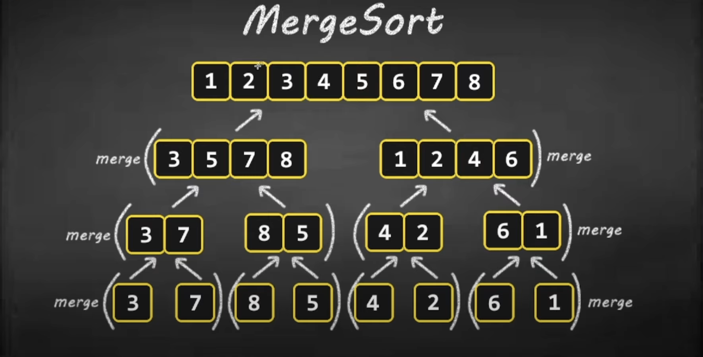

# Präsentation über MergeSort

**Präsentation von:** Yaser  
**Thema:** Mergesort Algorithmus  
**Dauer:** ca. 5 Minuten

*[Quelle](https://fullyunderstood.com/pseudocodes/merge-sort/)*

---

### Was ist MergeSort?  

MergeSort ist ein Sortieralgorithmus, der Daten in aufsteigende Reihenfolge bringt.  
Er nutzt das Prinzip **„Teile und Erobere“**, indem er grosse Aufgaben in kleinere, einfacher lösbare Teile zerlegt und diese schrittweise sortiert.  

---

### Warum ist MergeSort wichtig?  
- MergeSort ist einer der effizientesten Sortieralgorithmen mit einer garantierten Laufzeit von **O(n log n)**.  
- Er ist **stabil**, wodurch gleiche Elemente in ihrer Reihenfolge bleiben.  
- Er ist ideal für grosse Datenmengen geeignet.  

### Einsatzmöglichkeiten:  
MergeSort wird oft bei grossen Datenmengen genutzt, z. B. beim Sortieren von **Datenbanken** oder in der **Big-Data-Analyse**.

---

#### Kurzes Beispiel Bild 1

*[Quelle](https://www.youtube.com/watch?v=3j0SWDX4AtU&t=299s&ab_channel=BroCode)*

---

#### Kurzes Beispiel Bild 2

*[Quelle](https://www.youtube.com/watch?v=3j0SWDX4AtU&t=299s&ab_channel=BroCode)*

---

##### Vorteile:
- Effiziente Laufzeit: O(n log n)  
- Stabiler Algorithmus (gleiche Elemente bleiben in Reihenfolge)  
- Gut für große Datenmengen geeignet


*[Quelle](https://www.youtube.com/watch?v=3j0SWDX4AtU&t=299s&ab_channel=BroCode)*

---

##### Nachteile:
- Braucht zusätzlichen Speicher für das Mergen  
- Etwas komplexer als einfache Sortiermethoden wie Bubble Sort


*[Quelle](https://www.youtube.com/watch?v=3j0SWDX4AtU&t=299s&ab_channel=BroCode)*

---

### Coding Test Unit Test
- ich habe den Code in **PyCharm** geschrieben getestet und mit **Git** versioniert. Jede Änderung ist ein eigener Commit.

```Python
import unittest

from mergesort import mergesort


class MyTestCase(unittest.TestCase):
    def test_sorting(self):
        a = [99, 88, 77, 33, 11]  # Arrange
        result = mergesort(a)  # Act
        self.assertEqual([11,33,77,88,99], result)  # Assert
```
---

### Fazit

MergeSort ist ein starker Algorithmus, besonders für grosse Daten.  
Ich habe dabei gelernt, wie "Teile und Erobere" funktioniert.  
Das Projekt hat mir gezeigt, wie wichtig klare und strukturierte Arbeit ist.

---

## Quellen
- [Introduction to Algorithms (CLRS)](https://mitpress.mit.edu/books/introduction-algorithms)  
- [Python Dokumentation](https://docs.python.org)  
- [pytest Dokumentation](https://docs.pytest.org/)
- [Wikipedia](https://de.wikipedia.org/wiki/Mergesort)
---

## Danke fürs Zuhören!

### Falls ihr Fragen habt, beantworte ich diese gerne.


*[Quelle](https://stock.adobe.com/de/search?k=thumbs+up+emoji)*